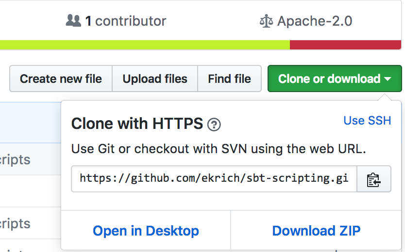

# Scripting using sbt, a build tool for Scala
## Introduction

The goal of this blog is to give a introduction to scripting on the Scala platform with an emphasis on *sbt* scripting. The examples are simple so the focus is on the mechanics and having all the code snippets you need so you can use them as a basis to create scripts for yourself or for your business.

I became interested in Scala so I decided to attend the Scala Days at Stanford in 2011. The job I had at the time was doing enterprise Java and I knew there was little hope for using Scala there but I really liked the job and projects we were working on so I started to write more functional code in Java while learning Scala on the side. Eventually I moved to another job and started to use Scala for Gatling as nobody cares what you use for testing. I got introduced to [sbt](http://www.scala-sbt.org/) to build the testing code. I was really impressed with the tool so I bought **sbt in Action** and started the slow process of learning about *sbt*. I started to look at the product I was working on and all the scripting was in bash and we developed on Windows so to test anything with scripting meant you had to push your code to a server to run your code. I wrote scripts using Java in the past so I thought it would be great to write them in Scala. I looked as Scala scripting but being spoiled by dependency management in sbt lead me to sbt scripting. I also had run across [Ammonite Ops](http://ammonite.io/#Ammonite-Ops) since my mind was focused on shell scripting. I thought it would be nifty to add this dependency in a sbt script so I could use the library. The first thing I found was that scripting was not supported on Windows and in Linux your file needed to end in .scala rather than .sh or without an extension. Needless to say I was disappointed.

Since I never had contributed to Open Source, was a novice at GitHub, and intermediate level in Scala, why not contribute to sbt? What could go wrong? Actually, both [Eugene Yokota](https://github.com/eed3si9n) and [Dale Wijnand](https://github.com/dwijnand) were super helpful and I was able to get everything running and debugging locally and I did my first Pull Request (PR) before Scala Days 2016 last year. Eugene was kind enough to help me get my PR ready for merging at the conference and shortly after that the support for sbt scripting for Windows was supported using .bat files and Unix/Linux added support for .sh or no extension. See the release notes for sbt [v0.13.12](https://github.com/sbt/sbt/releases/v0.13.12). During this development I found that quoted arguments were not passed correctly to scripts but the developers wanted this to be a separate issue so they could keep track of it in GitHub. This would have to wait for another PR. I also contributed this fix which was released in April 2017 in sbt [v0.13.15](https://github.com/sbt/sbt/releases/tag/v0.13.15).

## Script Tutorial

Before jumping into *sbt* scripting we should first review Scala scripting. Scripting has been supported from before 2008 as shown in this [blog entry](http://www.codecommit.com/blog/scala/scala-as-a-scripting-language) by Daniel Spiewak. Scripting has probably been in the language since the beginning because a Read Evaluate Print Loop (REPL) supports code evaluation. I found a reference from 2.9.0 in 2011 about the [Scala runner](http://www.scala-lang.org/download/changelog.html#scala-runner) as well. Please download the [code](https://github.com/ekrich/sbt-scripting) from GitHub so you can follow along. A simple way is to download the zip file as shown in Figure 1.

*Figure 1. Getting the code from GitHub*

If you haven't already, unzip the tutorial and change directory in your shell to *sbt-scripting-master*. Inside this directory you will see the following files and directories.

```
bin/
build.sbt
images/
LICENSE
project/
README.md
src/
```

### Scala Scripting

If you are already familiar with Scala scripting or just want to find out about *sbt* scripting you can skip this section. You can always refer back here if you desire.

In order to do Scala scripting you must download Scala and install it on your machine. You can download the latest release from [here](https://scala-lang.org/download/). Note that you must have **Java 8 JDK** installed as shown in Step 1 on that page. Scroll down to *"Other ways to install Scala"* or *"Other resources"*. You can find install instructions [here](https://scala-lang.org/download/install.html). Once you have these steps completed you can test your install in a shell or command window. All examples are on **macOS** but they should be the same on Linux or easy to translate as needed if you are on Windows. You can test Scala as follows:

``` script
Erics-MBP:sbt-scripting-master eric$ scala -version
Scala code runner version 2.12.3 -- Copyright 2002-2016, LAMP/EPFL and Lightbend, Inc.
```
The first thing we will do is run a script using Scala directly on the command line. Note that scripts cannot have `package org.example` for example at the top of the script. All imports must be classes in Scala or Java. You could have third part imports but then you would have to pass `-classpath <path>` to Scala and have the classes and/or jars available to Scala. Please run the following command.

```
Erics-MBP:sbt-scripting eric$ scala src/main/scala/ArgsScript.scala "foo bar" baz
Args: List(foo bar, baz)
```

The Script just prints the list of arguments.

In order to make it easier you can create a shell script or bat file to for your Scala script. In this case you may put the code directly in the script file. The following is an example for Unix/Mac/Linux. Refer to `bin/hellarg.sh` or [here](https://github.com/ekrich/sbt-scripting/blob/master/bin/helloarg.sh) on the web.

```Shell
#!/bin/sh
exec scala "$0" "$@"
!#
object HelloWorld {
  def main(args: Array[String]): Unit = {
  	println("Hello, world! " + args.mkString(","))
  }
}
```
Here is the example for Windows. Refer to `bin/hellarg.bat` or [here](https://github.com/ekrich/sbt-scripting/blob/master/bin/helloarg.bat) on the web.

```Batchfile
::#!
@echo off
call scala %~nx0 %*
goto :eof
::!#
object HelloWorld extends App {
  println("Hello, world! " + args.mkString(","))
}
```

Scala Scripts allow much of the same functionality as sbt scripts but you do not get the power of sbt and dependency management. This means that when you go to update/upgrade your script you must download the dependent jars and then package them with your script.

### Prerequisite for sbt Scripts

The first thing you should do is download and install **sbt** using the following link. [http://www.scala-sbt.org/download.html](http://www.scala-sbt.org/download.html). The tutorial uses versions `0.13.16` and `1.0.0` so the latest download may be necessary. **sbt** uses a launcher to start and this launcher has been changed in newer versions so a recent download is recommended.

Default logLevel in sbt is as follows: `logLevel in Global := Level.Warn`

There is a sbt script entry point that allows sbt to read an embedded build file from the script and then execute any script that follows.

 
Script file names may not have spaces in the file name or embedded periods except for the file extension. The periods get interpreted later downstream as a package name. Unix or Linux script files name can have no extension or `.sh` which are the normal conventions for sh and bash scripts. The file should be made executable via `chmod u+x <filename>` so it can be executed by the filename. Prior to the change I made sbt scripts only ran on Unix and they had to be named with a `.scala` extension. Now, any file extension or none is valid for Unix scripts so it is backward compatible.

Windows scripts must end in `.cmd` or in `.bat`. Batch files, can be executed with or without the extension. If executed without an extension the script must pass the full file name with the extension to sbt. In order to make sure this happens we use the following symbol for the file name argument `%~nx0` and pass that to sbt first and then pass the additional arguments via `%*`.


## References
1. Blog about sbt scripting. [http://eed3si9n.com/scripting-with-scala](http://eed3si9n.com/scripting-with-scala) 

2. Gist example. [https://gist.github.com/SethTisue/3a5a04e5054fc5b75011](https://gist.github.com/SethTisue/3a5a04e5054fc5b75011)

## Appendix: Ammonite


